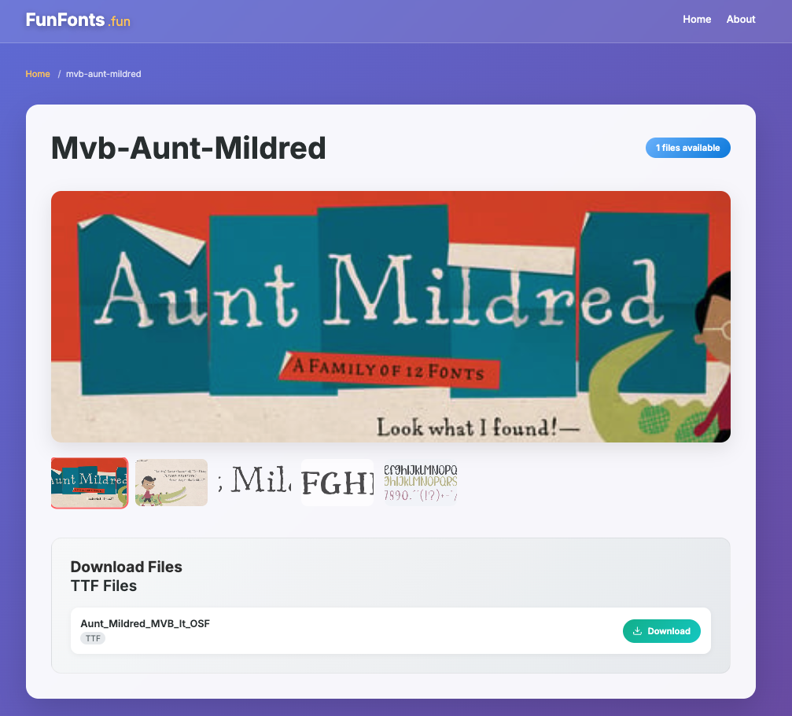
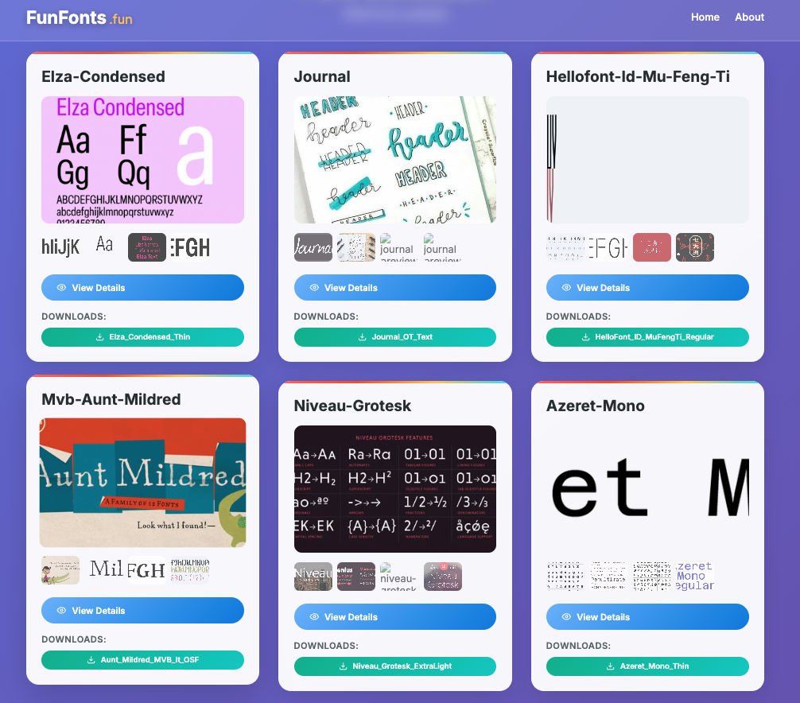

# FunFonts.fun

A modern web application for browsing and downloading free fonts built with Astro. FunFonts.fun provides a curated collection of high-quality fonts with instant downloads and no registration required.



## Features

- **Free Font Downloads**: Access to hundreds of free fonts in TTF and OTF formats
- **No Registration Required**: Download fonts instantly without creating an account
- **Interactive Preview Gallery**: Multiple preview images for each font with thumbnail navigation
- **Responsive Design**: Mobile-friendly interface with modern UI components
- **Pagination**: Organized font browsing with pagination support
- **Individual Font Pages**: Detailed font pages with comprehensive previews and download options
- **SEO Optimized**: Structured data markup and semantic HTML for better search engine visibility

## Tech Stack

- **Framework**: [Astro](https://astro.build/) - Static site generator with modern web technologies
- **Styling**: Component-scoped CSS with modern design patterns
- **Data**: JSON-based font collection with metadata
- **Features**: 
  - Static site generation for fast performance
  - Component-based architecture
  - Responsive design
  - Interactive JavaScript for enhanced UX

## Project Structure

```
/
├── public/          # Static assets (favicons, images, etc.)
├── src/
│   ├── components/  # Reusable Astro components
│   │   ├── FontCard.astro     # Font display card with preview gallery
│   │   ├── Header.astro       # Site navigation header
│   │   ├── Pagination.astro   # Page navigation component
│   │   ├── SearchBar.astro    # Font search functionality
│   │   └── Welcome.astro      # Welcome message component
│   ├── data/
│   │   └── fonts.json         # Font collection metadata
│   ├── layouts/
│   │   └── Layout.astro       # Base page layout
│   ├── pages/
│   │   ├── about.astro        # About page
│   │   ├── index.astro        # Homepage with font grid
│   │   ├── font/
│   │   │   └── [slug].astro   # Individual font pages
│   │   └── page/
│   │       └── [page].astro   # Paginated font listings
│   └── assets/                # Static assets
└── package.json
```

## Getting Started

### Prerequisites

- Node.js (v18 or higher)
- npm or yarn

### Installation

1. Clone the repository:
```bash
git clone https://github.com/temaprint/funfonts.fun.git
cd funfonts.fun
```

2. Install dependencies:
```bash
npm install
```

3. Start the development server:
```bash
npm run dev
```

4. Open your browser to `http://localhost:4321`

## Available Scripts

| Command | Description |
|---------|-------------|
| `npm run dev` | Start development server at `localhost:4321` |
| `npm run build` | Build production site to `./dist/` |
| `npm run preview` | Preview production build locally |
| `npm run astro` | Run Astro CLI commands |

## Font Collection

The font collection is stored in `src/data/fonts.json` with the following structure:

```json
{
  "title": "font-name",
  "src_pic_1": "preview-image-url",
  "src_pic_2": "preview-image-url",
  "src_pic_3": "preview-image-url",
  "src_pic_4": "preview-image-url",
  "src_pic_5": "preview-image-url",
  "ttf_files": ["font-file-url"],
  "otf_files": ["font-file-url"]
}
```

## Key Components

### FontCard Component
- Interactive preview gallery with thumbnail navigation
- Download buttons for TTF and OTF files
- Responsive design with hover effects
- Accessibility features and semantic markup

### Pagination Component
- Navigate through font collection pages
- Responsive pagination controls
- SEO-friendly URL structure

### Layout Component
- Base HTML structure with meta tags
- Responsive design foundation
- Dark gradient background with visual effects

## SEO & Accessibility

- Structured data markup (JSON-LD) for search engines
- Semantic HTML with proper ARIA labels
- Responsive design for all screen sizes
- Fast loading with optimized images and assets
- Screen reader friendly navigation

## Contributing

1. Fork the repository
2. Create a feature branch
3. Make your changes
4. Test thoroughly
5. Submit a pull request

## License

This project is for educational and portfolio purposes. Font licenses vary by individual font - please check individual font licenses before use.